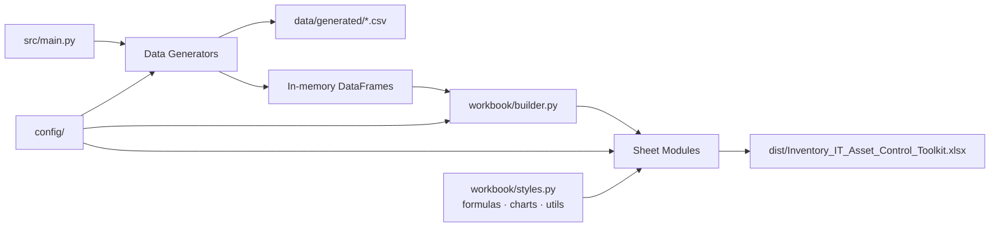
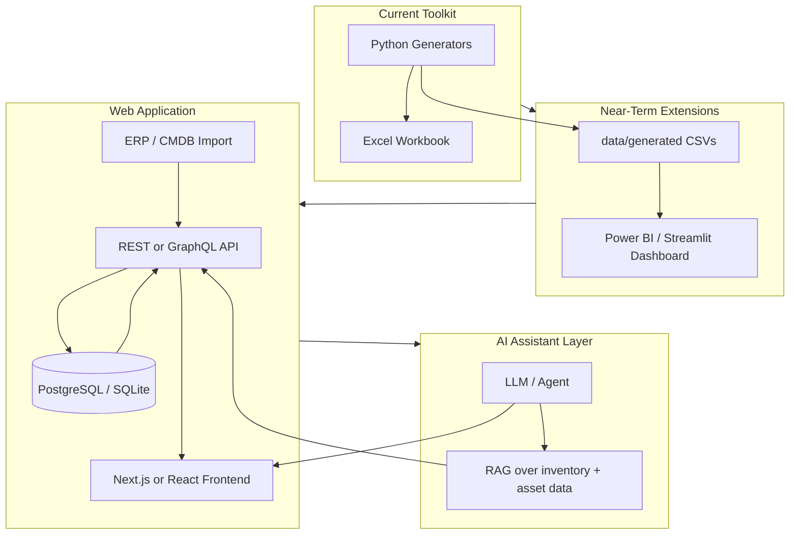

# Architecture Summary

**Inventory & IT Asset Control Toolkit** — how the project is organized, how data flows, and how to extend it.

---

## Purpose

This project generates a professional Excel workbook for two interview use cases:

1. **Inventory optimization** — dashboards, aged/excess analysis, transfer planning, markdown modeling  
2. **IT asset control** — asset register, audit reconciliation, software licenses, mobile provisioning, disposal

The architecture separates **data generation** from **workbook assembly** so business rules, styling, and sheet layout can evolve independently. A single command (`python src/main.py`) produces reproducible fictional sample data and a finished `.xlsx` file — no manual Excel editing, no macros.

All sample data is **fictional** and intended for portfolio and interview demos only.

---

## High-Level Flow



**Build sequence:**

1. Create output folders (`dist/`, `data/generated/`)
2. Generate five datasets (inventory, IT assets, software, mobile, disposal)
3. Save CSV snapshots for inspection and future BI use
4. Pass DataFrames to the workbook builder
5. Build each worksheet in order, apply styling and formulas
6. Save the final workbook

---

## Project Structure

```text
inventory-it-asset-toolkit/
├── config/
│   ├── workbook_config.py      # Paths, sheet order, thresholds, status labels
│   └── style_config.py         # Colors, fonts, number formats, risk mappings
├── data/generated/             # CSV output (gitignored)
├── dist/                       # Workbook output (gitignored)
├── docs/
│   ├── architecture.md         # This file
│   └── demo_script.md          # Interview demo scripts
├── src/
│   ├── main.py                 # CLI entry point
│   ├── data_generation/        # Fictional dataset generators
│   ├── workbook/               # Shared workbook utilities
│   ├── sheets/                 # One module per worksheet
│   └── tests/                  # pytest suite
├── PRD.md                      # Product requirements
├── specs.md                    # Technical specifications
├── requirements.txt
├── build.sh / build.bat        # One-command build wrappers
└── README.md
```

---

## Configuration Layer

Centralized in `config/` so constants are not scattered across sheet code.

| File | Responsibility |
|------|----------------|
| `workbook_config.py` | Workbook title, version, output path, sheet order, row counts, business thresholds (inventory aging, markdown rules, renewal windows, status/action labels) |
| `style_config.py` | Color palette, fonts, borders, KPI card styles, number formats, status → risk color mappings |

**Design choice:** Business rules live in config or data generators; presentation rules live in `style_config.py` and `workbook/styles.py`. Changing a threshold or color updates the entire workbook consistently.

---

## Data Generation Layer

**Location:** `src/data_generation/`

| Module | Output | Default rows |
|--------|--------|--------------|
| `generate_inventory.py` | Master inventory records | 120 |
| `generate_it_assets.py` | IT asset register records | 120 |
| `generate_software.py` | Software license records | 22 |
| `generate_mobile.py` | Mobile provisioning records | 45 |
| `generate_disposal.py` | Disposal log records | 25 |

Each generator:

- Exposes `generate_*_data(row_count, seed)` → `pandas.DataFrame`
- Exposes `save_*_data(df)` → writes CSV to `data/generated/`
- Defines a `COLUMN_ORDER` list aligned with its target sheet
- Uses **seeded randomness** (`RANDOM_SEED = 42`) for reproducible demos and tests
- Includes **curated scenarios** (e.g., over-assigned licenses, missing assets, pending wipe) so interviews always have meaningful examples

Business logic (status assignment, compliance flags, markdown percentages) is implemented in Python — not hand-entered in Excel — so rules are testable and auditable.

---

## Workbook Generation Layer

**Location:** `src/workbook/`

| Module | Responsibility |
|--------|----------------|
| `builder.py` | Orchestrates workbook creation; maps sheet names → builder functions; saves output |
| `styles.py` | Reusable styling: title banners, section headers, KPI cards, conditional formatting |
| `formulas.py` | Cross-sheet Excel formula builders (`SUMIF`, `COUNTIF`, `SUM`, etc.) |
| `charts.py` | Bar and pie chart helpers for dashboard sheets |
| `utils.py` | Column sizing, Excel tables, number formats, print layout |
| `validations.py` | Dropdown list validations (status, Yes/No, lifecycle, disposal) |

The builder creates an empty workbook, then iterates `SHEET_ORDER` from config:

```python
context = {"data": dataframes, "workbook": wb}
for sheet_name in SHEET_ORDER:
    ws = wb.create_sheet(title=sheet_name)
    SHEET_BUILDERS[sheet_name](ws, context)
```

Each sheet module receives the same **context dict** — shared data and workbook reference — keeping coupling low.

---

## Worksheet Modules

**Location:** `src/sheets/` — one file per tab, each exporting a `build(ws, context)` function.

| Sheet | Module | Data source |
|-------|--------|-------------|
| README | `readme_sheet.py` | Static content + config metadata |
| Master Inventory | `master_inventory_sheet.py` | `context["data"]["inventory"]` |
| Inventory Dashboard | `inventory_dashboard_sheet.py` | Inventory DataFrame + formulas → Master Inventory |
| Aged Excess Analysis | `aged_excess_sheet.py` | Derived from inventory |
| Markdown Planner | `markdown_planner_sheet.py` | Derived from inventory |
| Transfer Planner | `transfer_planner_sheet.py` | Derived from inventory |
| IT Asset Register | `it_asset_register_sheet.py` | `context["data"]["it_assets"]` |
| Audit Reconciliation | `audit_reconciliation_sheet.py` | Derived from IT assets |
| Software Licenses | `software_licenses_sheet.py` | `context["data"]["software"]` |
| Mobile Provisioning | `mobile_provisioning_sheet.py` | `context["data"]["mobile"]` |
| Disposal Log | `disposal_log_sheet.py` | `context["data"]["disposal"]` |
| Management Summary | `management_summary_sheet.py` | Formulas + derived risk rankings |

**Common pattern per sheet:**

1. Write title and optional summary KPIs  
2. Write table headers and data rows  
3. Apply number formats, Excel tables, conditional formatting  
4. Add validations, freeze panes, print settings  
5. Hide gridlines for a polished layout  

Some sheets use **live Excel formulas** referencing other tabs (dashboard, management summary). Others compute derived views in Python before writing cells (aged excess, transfer planner, audit reconciliation).

---

## Styling Layer

Styling is centralized so the workbook looks consistent without repeating code in every sheet.

| Layer | Where | What it controls |
|-------|-------|------------------|
| Constants | `config/style_config.py` | Hex colors, fonts, number formats, status → risk level maps |
| Application | `src/workbook/styles.py` | Functions to apply title banners, section headers, table headers, KPI cards, conditional formatting |
| Sheet-level | Individual sheet modules | Which columns get currency/date/integer formats; which status columns get CF |

**Risk-based conditional formatting** maps operational labels (e.g., `Over-Assigned`, `Pending Wipe`, `Missing`) to green / yellow / orange / red fills — making exceptions visible in live demos without extra narration.

---

## Testing Layer

**Location:** `src/tests/` — run with `pytest src/tests/`

| Test area | Examples |
|-----------|----------|
| Data generation | Non-empty data, required columns, business-rule scenarios, CSV export |
| Sheet builders | Structure, tables, formatting, validations per sheet |
| Workbook build | File created, all 12 sheets present, correct order, openpyxl readability |
| Requirements | Acceptance tests aligned with PRD/specs |
| Entry point | `main()` completes successfully |

Tests use seeded generators so results are deterministic. Workbook tests write to temporary paths — they do not depend on committed `.xlsx` files in `dist/`.

---

## How to Extend the Project

### Add a new worksheet

1. Add the sheet name to `SHEET_ORDER` in `config/workbook_config.py`  
2. Create `src/sheets/your_sheet.py` with a `build(ws, context)` function  
3. Register it in `SHEET_BUILDERS` in `src/workbook/builder.py`  
4. Add a focused test in `src/tests/`  
5. Re-run `python src/main.py`

### Add a new data domain

1. Create `src/data_generation/generate_*.py` with `COLUMN_ORDER`, `generate_*_data`, `save_*_data`  
2. Wire it into `src/main.py` → `generate_all_data()`  
3. Pass the new DataFrame through `context["data"]` to the sheet builder  
4. Add generator tests in `test_data_generation.py`

### Change business rules

- **Thresholds** (aging days, markdown %, renewal windows) → `config/workbook_config.py`  
- **Status labels / dropdown options** → `workbook_config.py` + `workbook/validations.py`  
- **Rule logic** → relevant generator or sheet module  

### Change visual design

- **Colors, fonts, formats** → `config/style_config.py`  
- **How styles are applied** → `src/workbook/styles.py`  

### Connect to real data later

Replace or supplement generators by loading CSV/ERP exports into the same DataFrame shapes (`COLUMN_ORDER`). The workbook layer does not need to change if column names and types stay consistent.

---

## Future Path: Web App or AI Assistant

The current architecture is intentionally layered so each tier can be replaced without rewriting the whole project.



| Phase | Direction | How this codebase helps |
|-------|-----------|-------------------------|
| **Dashboards** | Power BI or Streamlit on generated CSVs | CSVs already exported; business rules proven in Python |
| **Web app** | API + database + UI | Generators become ETL; `build()` pattern becomes report endpoints; config/thresholds become admin settings |
| **ERP integration** | Import from SAP, Oracle, WMS, ServiceNow | Replace generators with adapters; keep sheet/report logic or move to BI |
| **AI assistant** | Natural-language Q&A over inventory and assets | `COLUMN_ORDER`, status rules, and exception tabs define the semantic model an agent would query ("Show over-assigned licenses", "What is aged inventory value by location?") |

The **Management Summary** and **Inventory Dashboard** tabs already model the kind of executive answers an AI layer would surface — KPIs, top risks, and recommended actions — which makes this project a useful prototype for a future conversational analytics tool.

---

## Key Design Principles

1. **Separation of concerns** — data, logic, presentation, and orchestration are distinct  
2. **Reproducibility** — seeded data and automated tests support reliable demos  
3. **Config over hardcoding** — thresholds, sheet order, and styles live in one place  
4. **Interview-ready output** — professional styling, fictional data, two demo paths, printable summary  
5. **Extension without rewrites** — new sheets and data domains follow established patterns  

---

## Related Documentation

- [README.md](../README.md) — installation, usage, demo paths  
- [demo_script.md](demo_script.md) — 3-minute interview scripts  
- [PRD.md](../PRD.md) — product requirements  
- [specs.md](../specs.md) — technical specifications  
